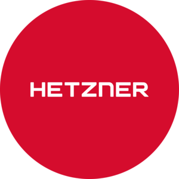
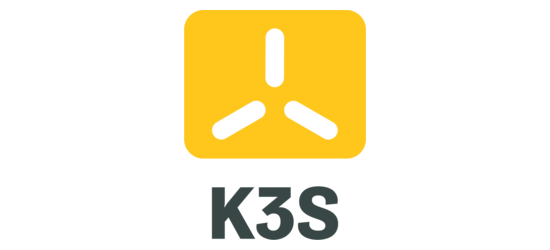
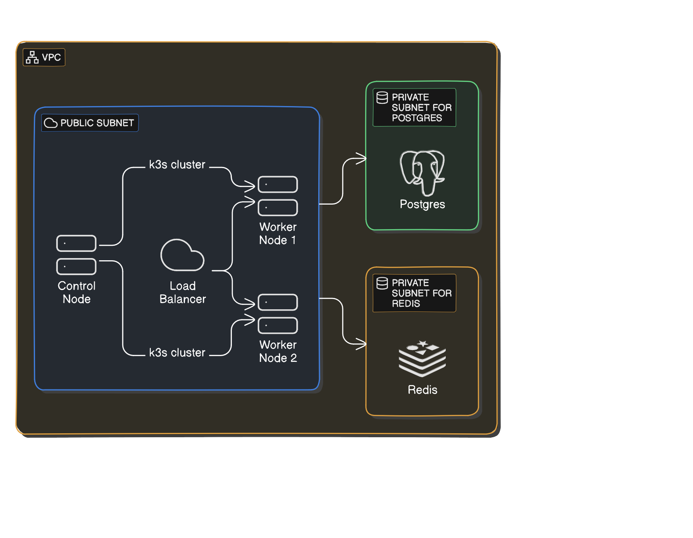

<h1 align="center">Nextcloud-k8s-demo-infra</h1>


<div align="center">
  
  
  
</div>

---

A demo infrastructure for NextCloud running on a self-managed/instaled k3s cluster on Hetzner cx22 instances. Using a sepparate Redis cache and Postgre DB in a seggregated private subnets connected to the main publi VPC with the k3s cluster. Access to the servers only allowed with private/public key-pair SSH keys and is automaticaly configured using your existing *~/.ssh/\** and *~/.kube/\** directories (Read the :warning: prerequisites bellow). Deployment of nextcloud is done using helm with cert-manager and nginx to ensure TLS/SSL encryption.

# Prerequisites

- Install OpenSSH   (For Ansible)
- Install Ansible   (Automation)
- Install Terraform (IaC)
- Install Helm      (Deployments)

:warning: The ansible module modifies the SSH keys directly in the ~/.ssh/* directory :warning:

:warning: The ansible module will overwrite the current ~/.ssh/config configuration :warning:

:warning: The ansible module creates a new ~/.kube/nextcloud_demo_kubeconfig configuration file :warning:

## Automatic documentation generation

Use the following command in the root of this repository to auto-generate the terraform docs for each of the modules:
```bash
for dir in modules/*/; do
    (cd "$dir" && terraform-docs markdown . > README.md)
done
```

## Infrastructure architecture

The infrastructure of the demo is composed of the following components:

- AWS resources (Phyical resources):
  - 1x S3 bucket for the Terraform state
  - 1x DynamoDB table for the Terraform state locking

- Hetzner servers (Phyical resources):
  - 1x cx22 instance for K3S control plane
  - 2x cx22 instances for K3S worker nodes (Can be scaled up or down)
  - 1x cx22 instance for Postgre DB
  - 1x cx22 instance for Redis cache

- Hetzner network (Phyical resources):
  - 1x VPC for the whole infrastructure
  - 1x public subnet for the K3S cluster
  - 1x private subnet for the Postgre DB
  - 1x private subnet for the Redis cache

- Hetzner firewall (Phyical resources):
  - 1x firewall for the K3S control plane
  - 2x firewall for the K3S worker nodes (Can be scaled up or down)
  - 1x firewall for the Postgre DB
  - 1x firewall for the Redis cache

- Hetzner load balancer (Phyical resources):
  - 1x load balancer for the K3S cluster connected to the K3S worker nodes

- Ansible:
  - 1x ansible playbook for the K3S cluster
  - 1x ansible playbook for the Postgre DB
  - 1x ansible playbook for the Redis cache

- Deployment:
  - 1x helm chart for Cloud Controller Manager
  - 1x helm chart for Cert Manager
  - 1x helm chart for Nginx Ingress Controller (Connected to the Hetzner load balancer through annotations)
  - 1x helm chart for Nextcloud

<div align="center">
  
</div>